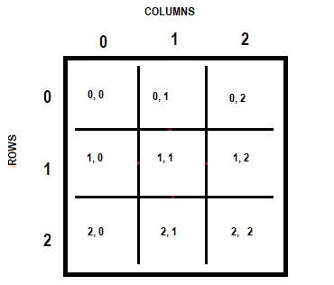

# Tic Tac Toe

## Introduction

It's difficult to find someone who does not know about tic tac toe game, or also called X's and O's.
It's a very simple game consisting in two players taking turns to place a tile in a 3x3 grid.
Wins who does the first three tile match in any direction (vertical, horizontal or diagonal).
Tile X always begins.   
This project is based on that game, with the interesting part that one of the players is the computer
itself. For programming it I've done a deep research to immerse myself in all the possible strategies
to avoid loss (I will explain later why I don't say "to win").

## Installation

First of all, what do I need to run the program? The environment must support Python, in my case,
I have used PyCharm Community. This version of the software is free and includes Git on its interface.
It's pretty intuitive, too.    
[PyCharm downloads](https://www.jetbrains.com/pycharm/download/#section=windows)    

**Modules**  
The only module I use is `copy` to duplicate the board's game. Using the most known operator `=`,
we don't create a new object, just a new variable that shares the reference of the original object.
With this module, a deep copy is done, meaning that we can change the content of the new object
without affecting the original. In this web called
[Programiz](https://www.programiz.com/python-programming/shallow-deep-copy) is explained in
detail.   

## Functionality

#### How do I play?

Playing is the easiest thing in this project, because there's no need for you to know how the program
is built. At the end, it's a paper and pencil game for all types of players. You just have to run
the compiler and follow the instructions that appear in the console.   
One important thing before playing is that the board is a list filled with three lists, each one a row.
That means that the cells are referred by its row and column number, similar to chess. Also, the count begins
on zero. The instructions will tell you when you need to write each one of the coordinates.   
   

#### Let's get serious. How is programmed it?

###### Important things to have in mind

Before diving deep into the strategies, there are a few things that one have to assume. The first one is
that it's impossible to always win, specially if you don't begin.  
With a small grid like this, with just 9 cells, the freedom of movement is not very wide. In just two or three
throws one must have to avoid the enemy's strategies and built one to win. That means, two players with just a 
bit of experience on the game will likely end in a tie.   
As I said, when you are the X tile, you play in advantage. With such small grid, beginning gives you more freedom
of movement and more capacity to prevent an ambush. When it happens, building up a strategy is the best way
to win.   
A tic tac toe strategy is made by creating two or more paths to complete the three tile match. These multiple
paths connect with each other because of the reduced space, and that why are called *forks*. There are four ways
of doing that:
     
As you can see, number one and two have three forks (red lines), and the last two only have two. For simplicity
purposes I have included the first and second. With just two forks, the opponent will block one, if in the next
move you have to block one of their tiles, the opponent will block your last fork. A three fork strategy gives
more possibilities and they really make the difference.

###### The project structure    
This project is made following the OOP conventions, so it's divided in classes:    
- **main**: it's a while loop, with an if/else condition that controls the players' turns until the board is full
or someone has won.    
- **user**: contains methods for asking the coordinates correctly, and choosing the tile.
- **machine**: where it's decided which is the best move for the current situation. Explained below.  

###### The brain of the program
I came up with 5 different moves:
- **danger**: this means the opponent has done a two-tile-match so, if you don't block it, you lose. The method
`line_state()` analyzes each row of the board. As we want to analyze columns and diagonals too, the `board_state()`
method deforms the grid and passes it to `line_state()` to do it. This last method can find danger, as well as
victory, and is used by the main class after each turn to know if someone has won. 
   
- **defense**: as the name suggests, the machine is not beginning, so it has to defend from the player's
strategies. As you can see in the last picture shown, the secret is to have more than one corner, so the
computer has to block the corners to avoid ambushes. The center is also a good option because it's the place
where most paths go though. This is done in the method with the same name `defense()`.    

- strategies: this movement is performed when machine is beginning and for the both it's only needed three
movements.    
    - **strategy one**: this one is simple than the next. Basically consist on occupying three corners. If the
    opponent blocks one of them, the machine will place it on the contrary. This will mislead the opponent, that
    maybe will try to do their own strategy instead of blocking another corner without danger.
    - **strategy two**: as center is a very demanded cell, it's important to place there the X in the first machine
    move. Then it's possible that the opponent uses a corner, so the machine does the same as in the first strategy,
    place it on the contrary. The second and last corner has to be the one without tiles between them.    
    
- **others**: when any of the movements above are suitable for the situation, the method `winning_branch()`
finds all the possible cells to place the tile until a three-match is done. That's why it is a recursive method,
creating a new branch for each move and evaluating them. It is a simple application of the minimax algorithm.

##### Inspiration   
At first I wanted to do a simple tic tac toe game, with two users but I saw a very interesting post on
Dev.to that inspired me to do something more difficult. Here is where I knew about minimax and learned
to use recursion:    
[Tic-Tac-Toe with the Minimax algorithm](https://dev.to/nestedsoftware/tic-tac-toe-with-the-minimax-algorithm-5988)     

Also, here's a good reflection about the strategies and possibilities of the game:
[Tic Tac Toe: First Move Strategy](https://funpaperandpencilgames.blogspot.com/2019/02/tic-tac-toe-strategy-tutorial.html)     

